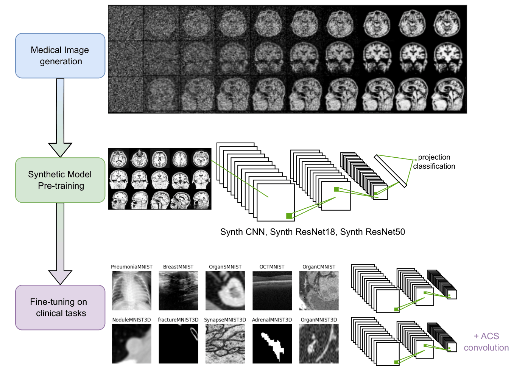

# Synthetic-MRI-models

## Synthetic MRI Pretraining for Medical Image Classification



This repository provides pretrained models and utilities for synthetic MRI-based transfer learning in medical image classification.

The proposed framework consists of three stages:

1. **Synthetic MRI generation** using Diffusion Models (DMs).
2. **Projection classification pretraining** on synthetic MRI data.
3. **Fine-tuning** on downstream 2D and 3D medical image classification tasks.

---

## Pipeline

### 1. Synthetic MRI Generation

Synthetic MRI projections are generated using Diffusion Models.

The implementation is available in the `/DM` folder of the **DM4AD** repository:

[DM4AD Repository](https://github.com/rturrisige/DM4AD)

### 2. Projection Classification Pretraining

A CNN is pretrained to classify MRI projection planes (axial, coronal, and sagittal).

The implementation is available in the `/TL` folder of the **DM4AD** repository:

[DM4AD Repository](https://github.com/rturrisige/DM4AD)

### 3. Fine-Tuning on Downstream Tasks

This repository provides the following scripts:

| Script | Description |
|----------|-------------|
| `fine_tuning_on_2Ddataset.py` | Fine-tuning on 2D MedMNIST datasets |
| `fine_tuning_on_3Ddataset.py` | Fine-tuning on 3D MedMNIST datasets |

For 3D datasets, **ACS convolutions** are automatically applied to convert pretrained 2D models into 3D architectures.

---

## Available Pretrained Models

- `ADnet`
- `resnet18`
- `resnet50`

Available input resolutions:

- `64 × 64`
- `128 × 128`

---

## Loading a Pretrained Model

### Define the Model

```python
model = 'ADnet'      # 'ADnet', 'resnet18', or 'resnet50'
input_dim = 128      # 64 or 128
n_classes = 2

w_path = f'./weights/{model}_{input_dim}x{input_dim}.pt'
```

### Load a Pretrained Model for 2D Data

```python
from utilities import load_pretrained_model

net = load_pretrained_model(
    model=model,
    w_path=w_path,
    n_classes=n_classes
)
```

### Load a Pretrained Model for 3D Data

```python
from utilities import load_ACS_pretrained_model

net = load_ACS_pretrained_model(
    model=model,
    config=config,
    w_path=w_path
)
```

ACS conversion automatically transforms pretrained 2D convolutional layers into 3D ACS convolutions suitable for volumetric medical imaging data.

---

## Citation

If you use this repository in your research, please cite the corresponding publication.
